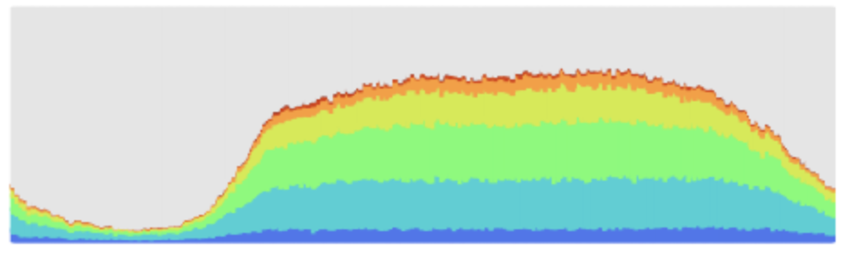
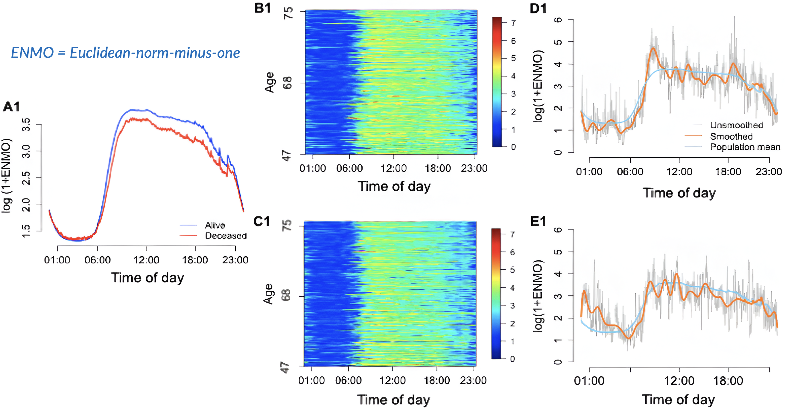
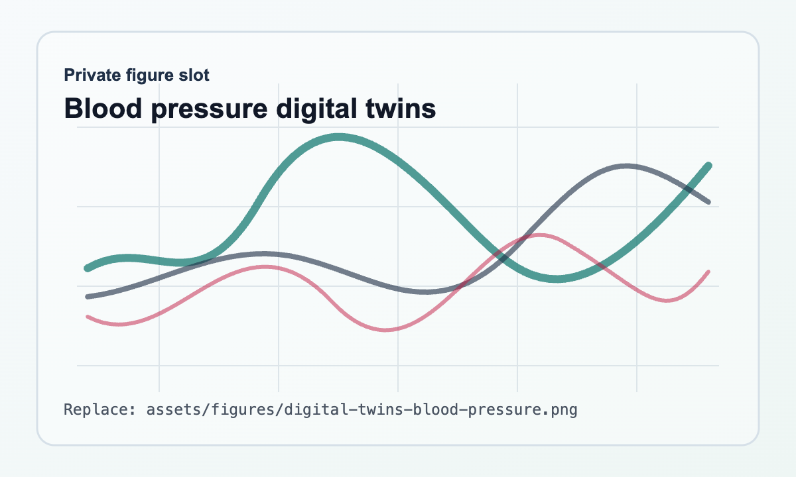
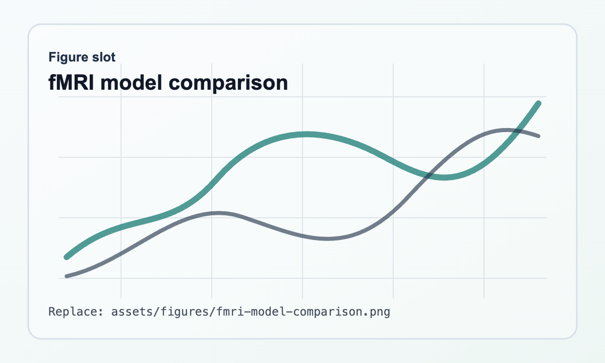
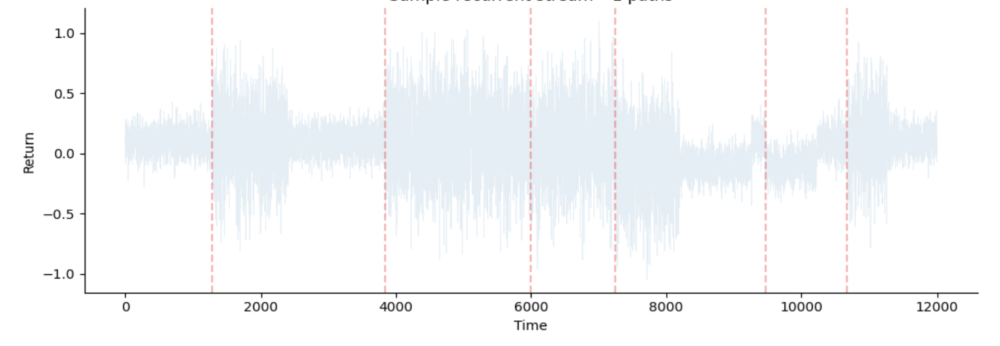
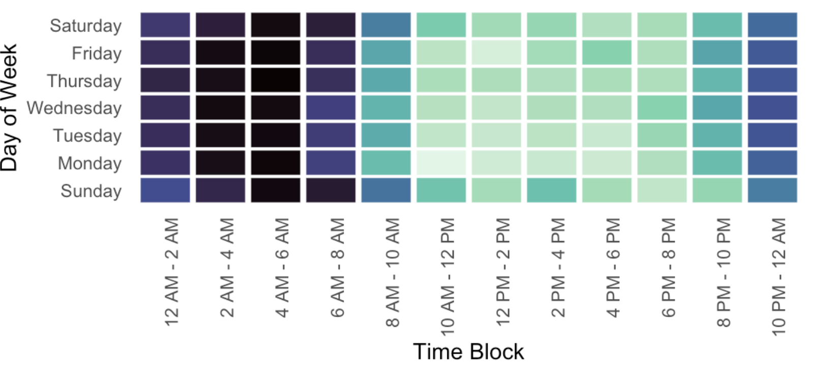
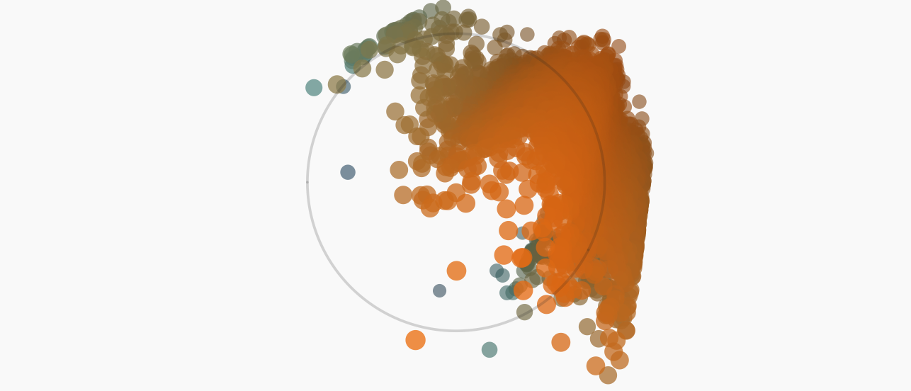

::: {.page-intro}
Selected research and applied projects around stochastic modeling, machine learning, survival analysis, and decision-oriented time-series data. Figure slots use fixed filenames under `assets/figures/` so real exported paper or project graphics can replace the placeholders without changing the page layout.
:::

## Research

::: {.project-grid}
::: {.project-card}
### Wearable activity and neurodegenerative disease risk

{.project-figure fig-alt="Placeholder figure: wearable risk summary"}

First-author work using wrist-worn accelerometry from the UK Biobank to predict incident Alzheimer's disease and Parkinson's disease. The modeling thread connects wearable sensor summaries, survival outcomes, variable selection, and risk prediction.

**Figure target:** `assets/figures/wearable-risk-summary.png`

[Publications](publications.qmd){.project-link}
:::

::: {.project-card}
### Functional Cox modeling for sensor/time-to-event data

{.project-figure fig-alt="Placeholder figure: functional Cox inference"}

Inference procedures for extended functional Cox models that account for correlation in time-series covariates. This project is the closest bridge between statistical theory, sensor data, and time-to-event prediction.

**Figure target:** `assets/figures/functional-cox-inference.png`

[Publications](publications.qmd){.project-link}
:::

::: {.project-card}
### Digital twins for blood pressure during cardiac surgery

{.project-figure fig-alt="Placeholder figure: digital twins for blood pressure during cardiac surgery"}

Private working paper: "Digital twins for blood pressure during cardiac surgery: Sky bridge functional autoencoders." The draft should stay local/private; this page only records the project title and research direction.

**Figure target:** `assets/figures/digital-twins-blood-pressure.png`
:::

::: {.project-card}
### Stochastic and neural models for fMRI dynamics

{.project-figure fig-alt="Placeholder figure: fMRI model comparison"}

Comparison of stochastic time-series models, RNNs, transformers, and autoregressive baselines for encoding and decoding fMRI dynamics. The project emphasizes model comparison under realistic temporal dependence.

**Figure target:** `assets/figures/fmri-model-comparison.png`

[Work](work.qmd){.project-link}
:::
:::

## Applied Projects

::: {.project-grid}
::: {.project-card}
### Adaptive Trading Dashboard

{.project-figure fig-alt="Placeholder figure: adaptive trading dashboard"}

Streamlit simulation dashboard for stress-testing CUSUM changepoint detectors, GARCH pre-whitening, rolling resets, and false-alarm trade-offs under Monte Carlo scenarios.

**Figure target:** `assets/figures/adaptive-trading-dashboard.png`

[Open dashboard](https://adaptive-trading.streamlit.app/){.project-link}
:::

::: {.project-card}
### Firehouse call volume forecasting

{.project-figure fig-alt="Placeholder figure: firehouse call forecast"}

Applied forecasting project with the Owings Mills Volunteer Firehouse to estimate call volume probabilities and support staffing decisions. The project is a practical example of operational prediction under uncertainty.

**Figure target:** `assets/figures/firehouse-call-forecast.png`
:::

::: {.project-card}
### Geometry-aware evolutionary LLMs

{.project-figure fig-alt="Placeholder figure: evolutionary LLM optimization"}

Exploratory project investigating genetic algorithms that use LLMs as mutation operators for non-differentiable optimization tasks.

**Figure target:** `assets/figures/evolutionary-llm-optimization.png`
:::
:::
